# ngods stock market demo 
This repository contains a stock market analysis demo of the ngods data stack. The demo performs the following steps:

1. Download selected stock symbols data from [Yahoo Finance API](https://finance.yahoo.com/).
2. Store the stock data in ngods data warehouse (using [Iceberg](https://iceberg.apache.org/) format).
3. Transform the data (e.g. normalize stock prices) using [dbt](https://www.getdbt.com/).
4. Expose analytics data model using [cube.dev](https://cube.dev/).
5. Visualize data as reports and dashboards using [Metabase](https://www.metabase.com/).

The demo is packaged as [docker-compose](https://github.com/docker/compose) script that downloads, installs, and runs all components of the data stack.

# ngods
ngods stands for New Generation Opensource Data Stack. It includes the following components: 

- [Apache Spark](https://spark.apache.org) for data transformation 
- [Apache Iceberg](https://iceberg.apache.org) as a data storage format 
- [Trino](https://trino.io/) for federated data query 
- [dbt](https://www.getdbt.com/) for ELT 
- [Dagster](https://dagster.io/) for data orchetsration 
- [cube.dev](https://cube.dev/) for data analysis and semantic data model 
- [Metabase](https://www.metabase.com/) for self-service data visualization (dashboards) 
- [Minio](https://min.io) for local S3 storage 

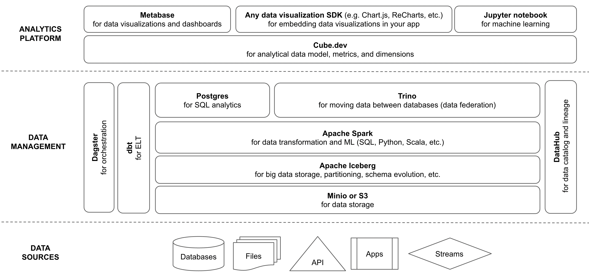

ngods is open-sourced under a [BSD license](https://github.com/zsvoboda/ngods-stocks/blob/main/LICENSE) and it is distributed as a docker-compose script that supports Intel and ARM architectures.

# Running the demo
ngods requires a machine with at least 16GB RAM and Intel or Arm 64 CPU running [Docker](https://www.docker.com/). It requires [docker-compose](https://github.com/docker/compose).

1. Clone the [ngods repo](https://github.com/zsvoboda/ngods-stocks)

```bash
git clone https://github.com/zsvoboda/ngods-stocks.git
```

2. Start the data stack with the `docker-compose up` command

```bash
cd ngods-stocks

docker-compose up -d
```

**NOTE:** This can take quite long depending on your network speed.

3. Stop the data stack via the `docker-compose down` command

```bash
docker-compose down
```

4. Execute the data pipeline from the Dagster console at http://localhost:3070/ with [this yaml config file](./projects/dagster/e2e.yaml).

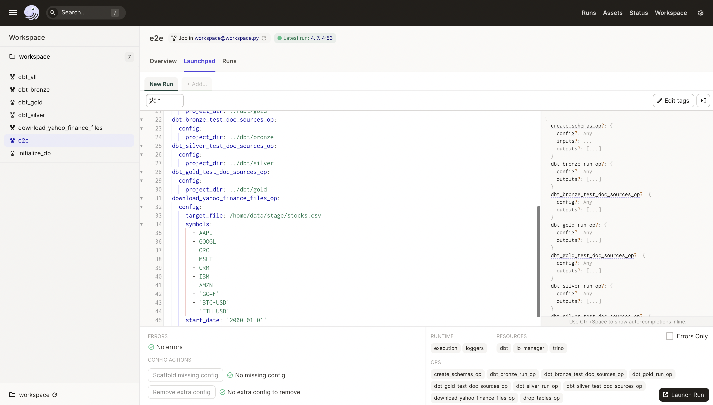

Cut and paste the content of the [e2e.yaml file](./projects/dagster/e2e.yaml) to this [Dagster UI console page](http://localhost:3070/workspace/workspace@workspace.py/jobs/e2e/playground) and start the data pipeline by clicking the `Launch Run` button. 

**NOTE:** You can customize the list of stock symbols that will be downloaded. 

5. Review and customize the [cube.dev metrics, and dimensions](./conf/cube/schema/). Test these metrics in the [cube.dev playground](http://localhost:4000/#/build?query={%22measures%22:[%22StockMarketsMonthly.price_close_relative_avg%22],%22timeDimensions%22:[{%22dimension%22:%22StockMarketsMonthly.dt%22,%22granularity%22:%22month%22,%22dateRange%22:[%222014-09-01%22,%222022-07-03%22]}],%22dimensions%22:[%22StockMarketsMonthly.symbol%22],%22filters%22:[{%22member%22:%22StockMarketsMonthly.symbol%22,%22operator%22:%22equals%22,%22values%22:[%22AAPL%22,%22GC=F%22,%22BTC-USD%22]}],%22order%22:[[%22StockMarketsMonthly.symbol%22,%22asc%22],[%22StockMarketsMonthly.dt%22,%22desc%22]]}).

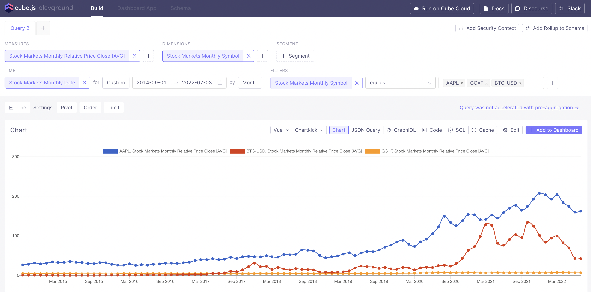

See the [cube.dev documentation](https://cube.dev/docs/) for more information.

6. Check out the Metabase [data visualizations](http://localhost:3030/question#eyJkYXRhc2V0X3F1ZXJ5Ijp7InR5cGUiOiJuYXRpdmUiLCJuYXRpdmUiOnsicXVlcnkiOiJzZWxlY3QgXG4gICAgICAgIGR0LCBcbiAgICAgICAgc3ltYm9sLCBcbiAgICAgICAgcHJpY2VfY2xvc2VfcmVsYXRpdmVfYXZnIFxuICAgIGZyb20gU3RvY2tNYXJrZXRzTW9udGhseVxuICAgIHdoZXJlIFxuICAgICAgICBzeW1ib2wgaW4gKCdBQVBMJywgJ0JUQy1VU0QnLCAnR0M9RicpIGFuZCBcbiAgICAgICAgZHQgPj0gJzIwMTQtMDktMDEnXG4gICAgb3JkZXIgYnkgZHQsIHN5bWJvbFxuICAgICIsInRlbXBsYXRlLXRhZ3MiOnt9fSwiZGF0YWJhc2UiOjN9LCJkaXNwbGF5IjoibGluZSIsImRpc3BsYXlJc0xvY2tlZCI6dHJ1ZSwidmlzdWFsaXphdGlvbl9zZXR0aW5ncyI6eyJncmFwaC5kaW1lbnNpb25zIjpbImR0Iiwic3ltYm9sIl0sImdyYXBoLm1ldHJpY3MiOlsicHJpY2VfY2xvc2VfcmVsYXRpdmVfYXZnIl0sImdyYXBoLnhfYXhpcy50aXRsZV90ZXh0IjoiRGF0ZSAobW9udGhzKSIsImdyYXBoLnlfYXhpcy50aXRsZV90ZXh0IjoiQ2xvc2UgcHJpY2UgKHJlbGF0aXZlIHRvIEphbiAxc3QgMjAwMCkifSwib3JpZ2luYWxfY2FyZF9pZCI6MzN9) that is connected to the cube.dev analytical model. You can run [SQL queries](https://cube.dev/docs/backend/sql) on top of the cube.dev schema.  
 
 Use username `metabase@ngods.com` and password `metabase1`.

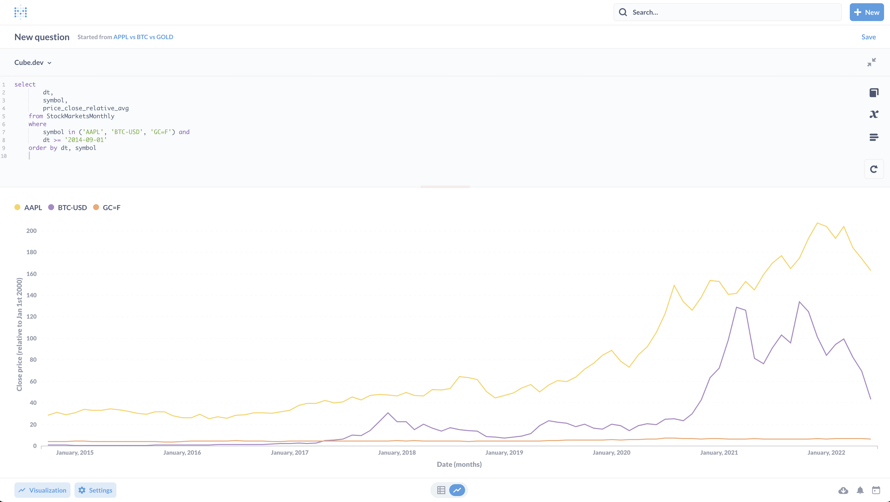

You can create your own data visualizations and dashboards. See the [Metabase documentation](https://metabase.com/docs/latest) for more information.

7. Predict stock close price. Run the [ARIMA time-series prediction model](http://localhost:8888/notebooks/notebooks/arima.ipynb) notebook that is trained on 29 months of the `Apple:AAPL` stock data and predicts the next month.

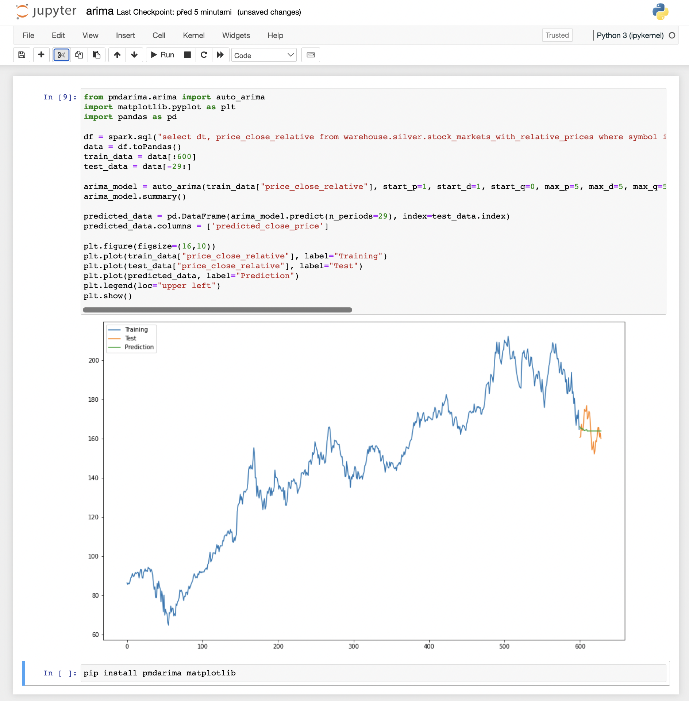

8. Download [DBeaver](https://dbeaver.io/download/) SQL tool.

9. Connect to the Postgres database that contains the `gold` stage data. Use `jdbc:postgresql://localhost:5432/postgres` JDBC URL with username `postgres` and password `postgres`.

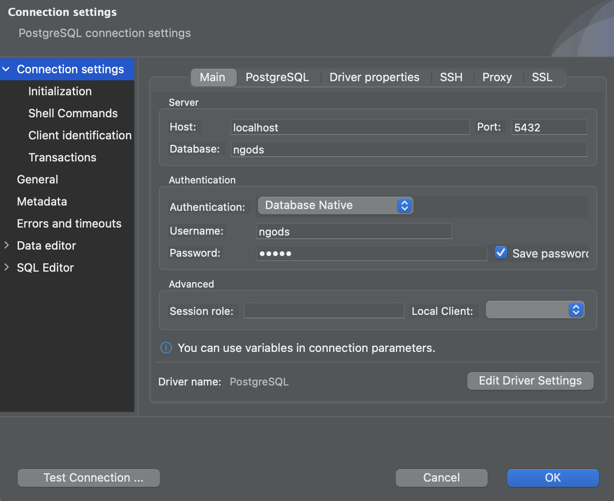

10. Connect to the Trino database that has access to all data stages (`bronze`, `silver`, and `gold` schemas of the `warehouse` database). Use `jdbc:trino://localhost:8060` JDBC URL with username `trino` and password `trino`. 

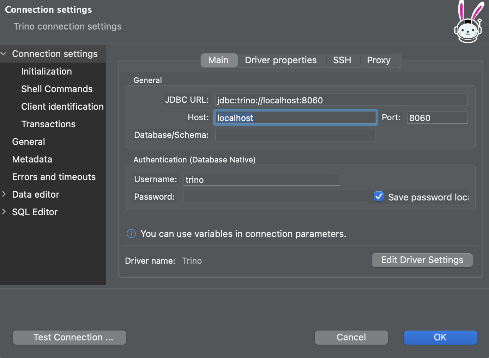

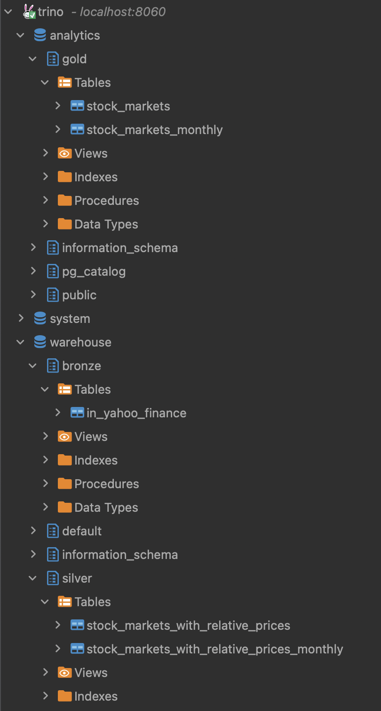

11. Connect to the Spark database that is used for data transformations. Use `jdbc:hive2://localhost:10000` JDBC URL with no username and password. You'll need to specify JDBC driver property `auth=noSasl` for this connection.

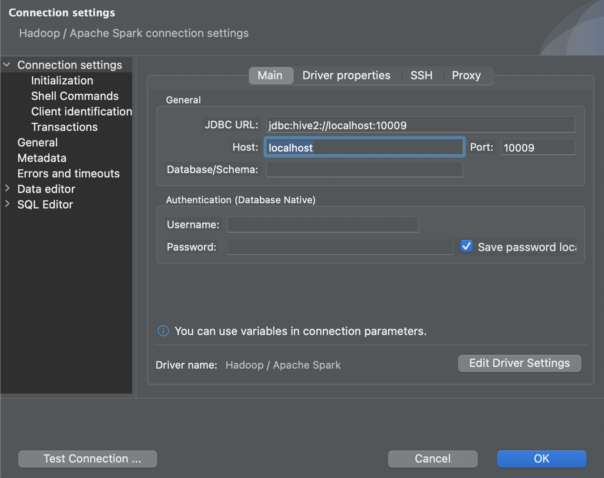

# Customizing the demo
This chapter contains useful information for customizing the demo.

## ngods directories
Here are few distribution's directories that you may need to customize:

- `conf` configuration of all data stack components
    - `cube` cube.dev schema (semantic model definition)
- `data` main data directory 
    - `minio` root data directory (contains buckets and file data)
    - `spark` Jupyter notebooks
    - `stage` file stage data. Spark can access this directory via `/home/data/stage/` path. 
- `projects` dbt, Dagster, and DataHub projects
    - `dagster` Dagster orchestration project
    - `dbt` dbt transformations (one project per each medallion stage: `bronze`, `silver`, and `gold`) 

## ngods endpoints
The data stack has the following endpoints

- Spark
    - http://localhost:8888 - Jupyter notebooks 
    - `jdbc:hive2://localhost:10000;auth=noSasl` JDBC URL (no username / password)
    - localhost:7077 - Spark API endpoint
    - http://localhost:8061 - Spark master node monitoring page 
    - http://localhost:8062 - Spark slave node monitoring page 
    - http://localhost:18080 - Spark history server page 
- Trino
    - `jdbc:trino://localhost:8060` JDBC URL (username `trino` / no password)
- Postgres
    - `jdbc:postgresql://localhost:5432/ngods` JDBC URL (username `ngods` / password `ngods`)
- Cube.dev
    - http://localhost:4000 - cube.dev development UI 
    - `jdbc:postgresql://localhost:3245/cube` JDBC URL (username `cube` / password `cube`)
- Metabase
    - http://localhost:3030 Metabase UI (username `metabase@ngods.com` / password `metabase1`)
- Dagster
    - http://localhost:3070 - Dagster orchestration UI
- Minio
    - http://localhost:9001 - Minio UI (username `minio` / password `minio123`)

## ngods databases: Spark, Trino, and Postgres
ngods stack includes three database engines: Spark, Trino, and Postgres. Both Spark and Trino have access to Iceberg tables in `warehouse.bronze` and `warehouse.silver` schemas. Trino engine can also access the `analytics.gold` schema in Postgres. Trino can federate queries between the Postgres and Iceberg tables. 

The Spark engine is configured for ELT and pyspark data transformations. 


The Trino engine is configured for data federation between the Iceberg and Postgres tables. Additional catalogs can be [configured](./conf/trino/catalog) as needed. 

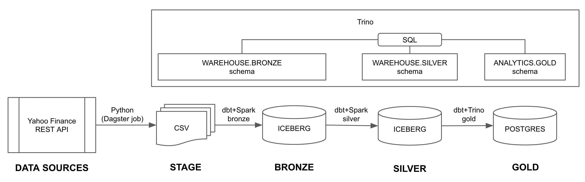

The Postgres database has accesses only to the `analytics.gold` schema and it is used for executing analytical queries over the gold data.

## Demo data pipeline
The demo data pipeline is utilizes the [medallion architecture](https://databricks.com/fr/glossary/medallion-architecture) with `bronze`, `silver`, and `gold` data stages. 


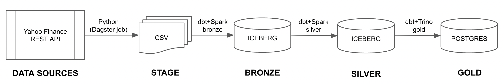

and consists of the following phases:

1. Data are downloaded from Yahoo Finance REST API to the local Minio bucket ([./data/stage](./data/stage)) using this [Dagster operation](./projects/dagster/download.py).
2. The downloaded CSV file is loaded to the bronze stage Iceberg tables (warehouse.bronze Spark schema) using dbt models that are executed in Spark ([./projects/dbt/bronze](./projects/dbt/bronze/models/in_yahoo_finance.sql)).
3. Silver stage Iceberg tables (warehouse.silver Spark schema) are created using dbt models that are executed in Spark ([./projects/dbt/silver](./projects/dbt/silver/models/stock_markets_with_relative_prices.sql)). 
5. Gold stage Postgres tables (analytics.gold Trino schema) are created using dbt models that are executed in Trino ([./projects/dbt/gold](./projects/dbt/gold/models/stock_markets.sql)).

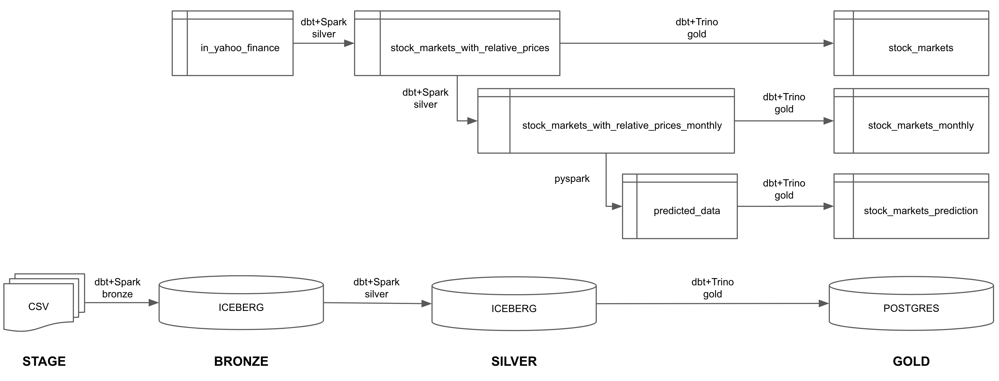

All data pipeline phases are orchestrated by [Dagster](https://www.dagster.io/) framework. Dagster operations, resources and jobs are defined in the [Dagster project](./projects/dagster/). 

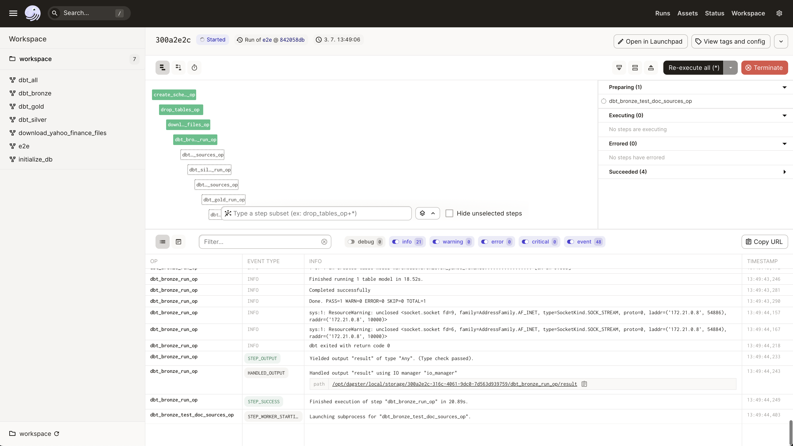

The pipeline is executed by running the e2e job from the Dagster console at http://localhost:3070/ using [this yaml config file](./projects/dagster/e2e.yaml)

## ngods analytics layer
ngods includes [cube.dev](https://cube.dev/) for [semantic data model](./conf/cube/schema) and [Metabase](https://www.metabase.com/) for self-service analytics (dashboards, reports, and visualizations).

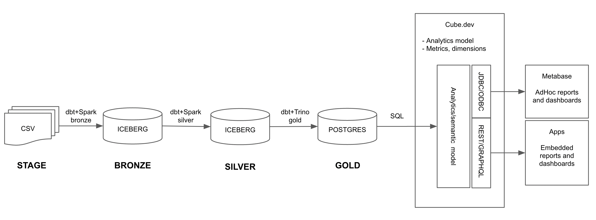

Analytical (semantic) model is defined in [cube.dev](https://cube.dev/) and is used for executing analytical queries over the gold data.

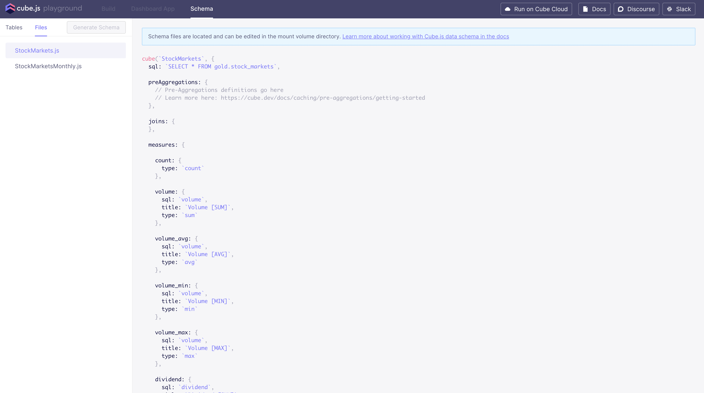

[Metabase](https://www.metabase.com/) is connected to the [cube.dev](https://cube.dev/) via [SQL API](https://cube.dev/docs/backend/sql). End users can use it for self-service creation of dashboards, reports, and data visualizations. [Metabase](https://www.metabase.com/) is also directly connected to the gold schema in the Postgres database.

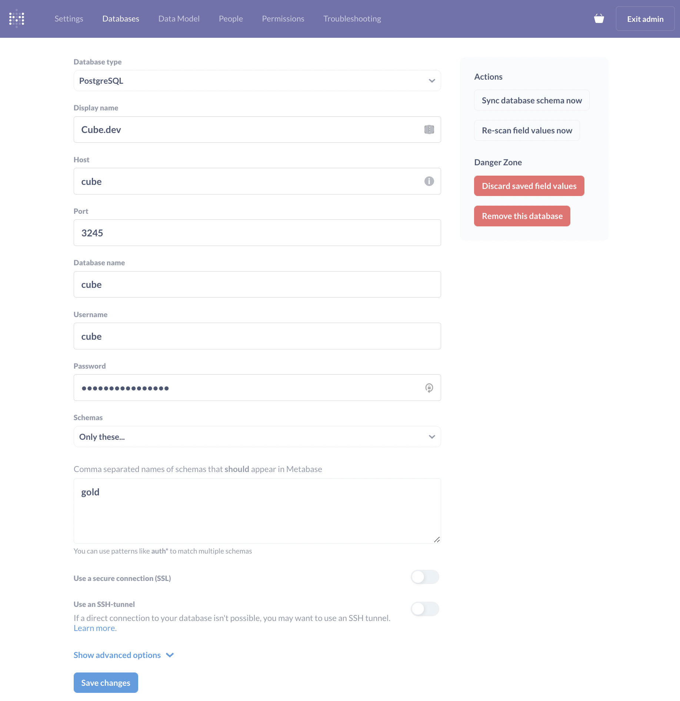

## ngods machine learning
[Jupyter Notebooks](https://jupyter.org/) with Scala, Java and Python backends can be used for machine learning.


## ngods data catalog and governance
ngods uses [DataHub](https://www.datahub.io/) as data catalog and for governance purposes. DataHub crawls all the data from the data stack and stores it in the catalog. 

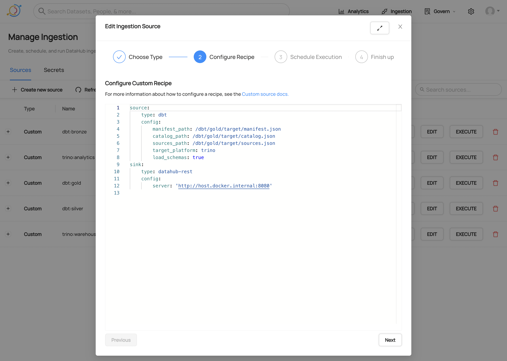

DataHub catalog contains all database tables, their schemas, and dependencies.  

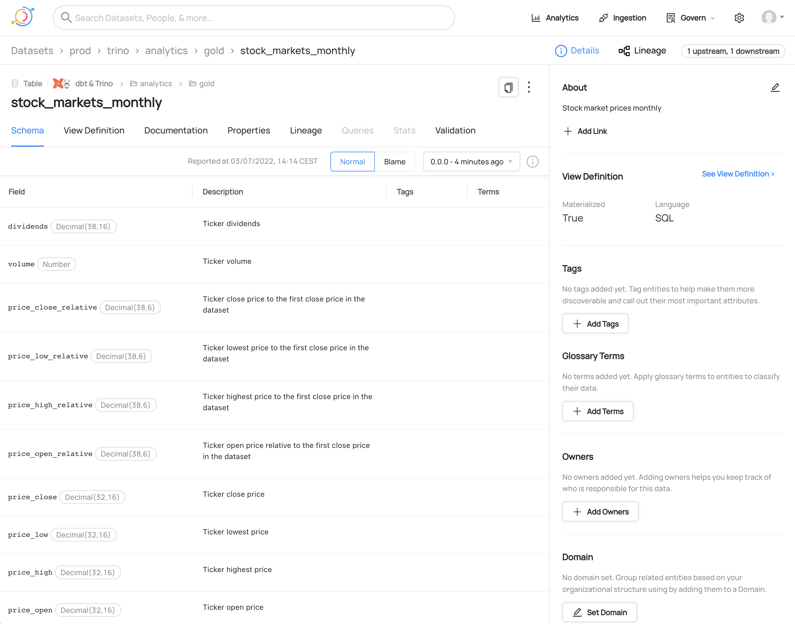

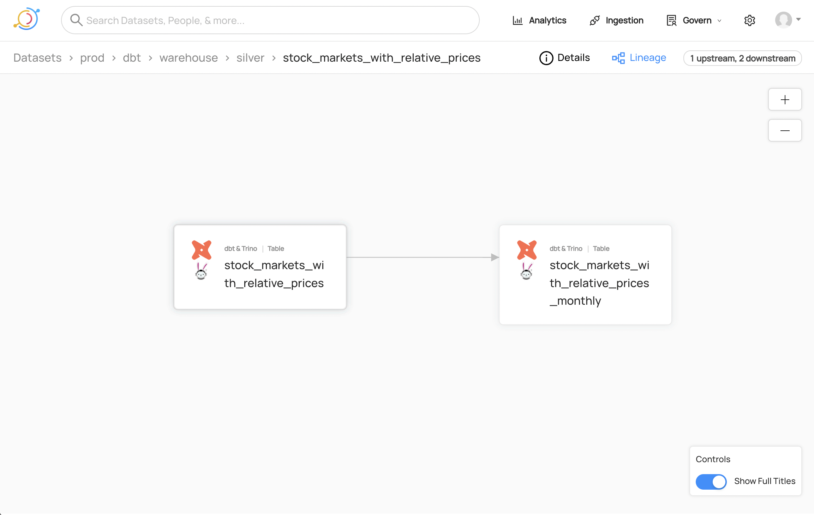

DataHub crawling recipes are stored in the [DataHub project directory](./projects/datahub/).

**NOTE:** DataHub is not included in this demo. 

# Support
Create a [github issue](https://github.com/zsvoboda/ngods-stocks/issues) if you have any questions.
