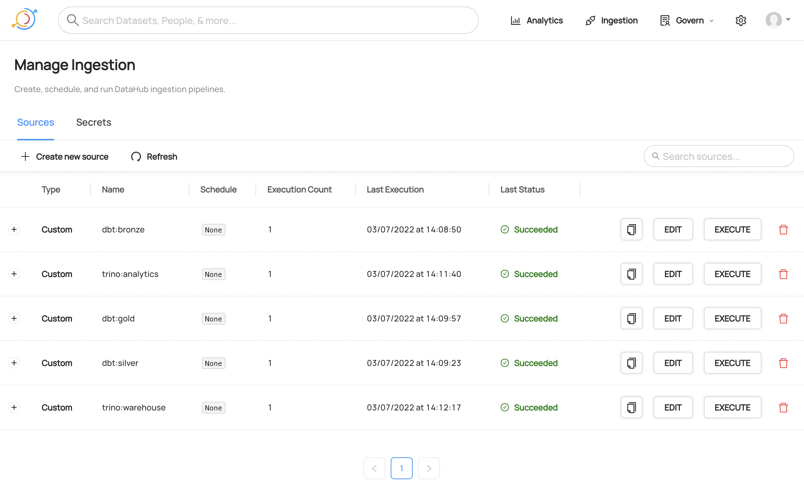

# ngods stock market demo 
This repository contains a simple stock market demo of ngods data stack. This demo shows how to use the ngods data stack to create a simple stock market analytsis demo. It performs the following steps:

1. Download historical ticker data from [Yahoo Finance API](https://finance.yahoo.com/).
2. Store the data in ngods data warehouse (using [Iceberg](https://iceberg.apache.org/) format).
3. Transform the data (e.g. normalize ticker prices) using [dbt](https://www.getdbt.com/).
4. Create a analytics data model using [cube.dev](https://cube.dev/).
5. Create data visualizations and dashboards using [Metabase](https://www.metabase.com/).

The demo is packaged as [docker-compose](https://github.com/docker/compose) script that downloads, installs, and runs all components of the ngods dayta stack and the demo.

# ngods
ngods stands for New Generation Opensource Data Stack. It includes the following components: 

- [Minio](https://min.io) for local S3 storage 
- [Apache Iceberg](https://iceberg.apache.org) as a data storage format 
- [Apache Spark](https://spark.apache.org) for data transformation 
- [Trino](https://trino.io/) for federated data query 
- [dbt](https://www.getdbt.com/) for ELT 
- [Dagster](https://dagster.io/) for data orchetsration 
- [DataHub](https://datahubproject.io/) as a data catalog and governance layer
- [cube.dev](https://cube.dev/) for data analysis and semantic data model 
- [Metabase](https://www.metabase.com/) for self-service data visualization (dashboards) 


ngods data pipeline is inspired by [Databrick’s medallion architecture](https://databricks.com/fr/glossary/medallion-architecture) that uses bronze, silver, and gold data stages. 

ngods is open-sourced under a [BSD license](https://github.com/zsvoboda/ngods-stocks/blob/main/LICENSE) and it is distributed as a docker-compose script that supports Intel and ARM architectures.

## ngods installation
ngods requires a machine with at least 16GB RAM and Intel or Arm 64 CPU running [Docker](https://www.docker.com/). It requires [docker-compose](https://github.com/docker/compose).

1. Clone the [ngods repo](https://github.com/zsvoboda/ngods-stocks)

```bash
git clone https://github.com/zsvoboda/ngods-stocks.git
```

2. Select `docker-compose` script for your CPU architecture 

```bash
cd ngods-stocks

# use the docker-compose.x86.yml for Intel CPU 
cp docker-compose.x86.yml docker-compose.yml

# use the docker-compose.arm64.yml for ARM (e.g. Apple M1/M2)
cp docker-compose.arm64.yml docker-compose.yml

# use the docker-compose.no.datahub.yml in case you have a slower hardware
# or not enough memory
# Datahub won't be running in this setup
cp docker-compose.no.datahub.yml docker-compose.yml
```

3. Start it using the `docker-compose up` command

```bash
docker-compose up -d
```

This can take quite long depending on your network speed.

4. Stop it using the `docker-compose down` command

```bash
docker-compose down
```

## ngods directories
Here are few distribution's directories that you'll need:

- `conf` configuration of all data stack components
    - `cube` cube.dev schema (semantic model definition)
    - `trino` Trino config files and catalogs definitions
    - `spark` Spark configuration
- `data` main data directory 
    - `minio` root data directory (contains buckets and file data)
    - `spark` Jupyter notebooks
    - `stage` file stage data. Spark can access this directory via `/home/data/stage/` path. 
- `projects` dbt, Dagster, and DataHub projects
    - `dagster` Dagster orchestration project
    - `datahub` DataHub catalog crawling recipes 
    - `dbt` dbt transformations (one project per each medallion stage: `bronze`, `silver`, and `gold`) 

## ngods endpoints
The data stack has the following endpoints

- Spark
    - http://localhost:8888 - Jupyter notebooks 
    - `jdbc:hive2://localhost:10000` JDBC URL (no username / password)
    - localhost:7077 - Spark API endpoint
    - http://localhost:8061 - Spark master node monitoring page 
    - http://localhost:8062 - Spark slave node monitoring page 
    - http://localhost:18080 - Spark history server page 
- Trino
    - `jdbc:trino://localhost:8060` JDBC URL (username `trino` / no password)
- Postgres
    - `jdbc:postgresql://localhost:5432/postgres` JDBC URL (username `postgres` / password `postgres`)
- Cube.dev
    - http://localhost:4000 - cube.dev development UI 
    - `jdbc:postgresql://localhost:3245/cube` JDBC URL (username `cube` / password `cube`)
- Metabase
    - http://localhost:3030 Metabase UI (username `metabase@ngods.com` / password `metabase1`)
- Dagster
    - http://localhost:3070 - Dagster orchestration UI
- DataHub
    - http://localhost:9002 - DataHub catalog UI
- Minio
    - http://localhost:9001 - Minio UI (username `minio` / password `minio123`)

## ngods databases: Spark, Trino, and Postgres
ngods stack includes three database engines: Spark, Trino, and Postgres. Both Spark and Trino have access to Iceberg tables in `warehouse.bronze` and `warehouse.silver` schemas. Trino engine can also access the `analytics.gold` schema in Postgres. Trino can federate queries between the Postgres and Iceberg tables. 

The Spark engine is configured for ELT and pyspark data transformations. 


The Trino engine is configured for data federation between the Iceberg and Postgres tables. Additional catalogs can be [configured](./conf/trino/catalog) as needed. 


The Postgres database has accesses only to the `analytics.gold` schema and it is used for executing analytical queries over the gold data.

## ngods analytics layer
ngods includes [cube.dev](https://cube.dev/) for [semantic data model](./conf/cube/schema) and [Metabase](https://www.metabase.com/) for self-service analytics (dashboards, reports, and visualizations).


Analytical (semantic) model is defined in [cube.dev](https://cube.dev/) and is used for executing analytical queries over the gold data.


[Metabase](https://www.metabase.com/) is connected to the [cube.dev](https://cube.dev/) via [SQL API](https://cube.dev/docs/backend/sql). End users can use it for self-service creation of dashboards, reports, and data visualizations. [Metabase](https://www.metabase.com/) is also directly connected to the gold schema in the Postgres database.


## ngods machine learning
[Jupyter Notebooks](https://jupyter.org/) can be used for machine learning.


## ngods data catalog and governance
ngods uses [DataHub](https://www.datahub.io/) as data catalog and for governance purposes. DataHub crawls all the data from the data stack and stores it in the catalog. 


DataHub catalog contains all database tables, their schemas, and dependencies.  


DataHub crawling recipes are stored in the [DataHub project directory](./projects/datahub/).

# Stock market analysis demo 
This stock market demo allows you to perform ad-hoc data analysis of selected tickers data.


## Demo data pipeline
The demo data pipeline is utilizes the [Databrick’s medallion architecture](https://databricks.com/fr/glossary/medallion-architecture)


and consists of the following phases:

1. Data are downloaded from Yahoo Finance REST API to the local Minio bucket ([./data/stage](./data/stage)) using this [Dagster operation](./projects/dagster/download.py).
2. The downloaded CSV file is loaded to the bronze stage Iceberg tables (warehouse.bronze Spark schema) using dbt models that are executed in Spark ([./projects/dbt/bronze](./projects/dbt/bronze/models/in_yahoo_finance.sql)).
3. Silver stage Iceberg tables (warehouse.silver Spark schema) are created using dbt models that are executed in Spark ([./projects/dbt/silver](./projects/dbt/silver/models/stock_markets_with_relative_prices.sql)). 
5. Gold stage Postgres tables (analytics.gold Trino schema) are created using dbt models that are executed in Trino ([./projects/dbt/gold](./projects/dbt/gold/models/stock_markets.sql)).

All data pipeline phases are orchestrated by [Dagster](https://www.dagster.io/) framework. Dagster operations, resources and jobs are defined in the [Dagster project](./projects/dagster/). 


The pipeline is executed by running the e2e job from the Dagster console at http://localhost:3070/ using [this yaml config file](./projects/dagster/e2e.yaml)

All tables and their dependencies are registered in DataHub catalog that is available at http://localhost:9002/. DataHub crawling recipes are defined in the [DataHub project](./projects/datahub/).

### dbt models
There are three dbt models. One for each medaillon stage: `bronze`, `silver`, and `gold`.


The dbt models are defined in the [dbt project](./projects/dbt/).

## Demo analytics stack
The demo analytics model is defined in the [cube.dev schema](./conf/cube/schema/). You can run the [cube.dev playground](http://localhost:4000/#/build?query={%22measures%22:[%22StockMarketsMonthly.price_close_relative_avg%22],%22timeDimensions%22:[{%22dimension%22:%22StockMarketsMonthly.dt%22,%22granularity%22:%22month%22,%22dateRange%22:[%222014-09-01%22,%222022-07-03%22]}],%22dimensions%22:[%22StockMarketsMonthly.symbol%22],%22filters%22:[{%22member%22:%22StockMarketsMonthly.symbol%22,%22operator%22:%22equals%22,%22values%22:[%22AAPL%22,%22GC=F%22,%22BTC-USD%22]}],%22order%22:[[%22StockMarketsMonthly.symbol%22,%22asc%22],[%22StockMarketsMonthly.dt%22,%22desc%22]]}) to test it.  

[Metabase](http://localhost:3030/question#eyJkYXRhc2V0X3F1ZXJ5Ijp7InR5cGUiOiJuYXRpdmUiLCJuYXRpdmUiOnsicXVlcnkiOiJzZWxlY3QgXG4gICAgICAgIGR0LCBcbiAgICAgICAgc3ltYm9sLCBcbiAgICAgICAgcHJpY2VfY2xvc2VfcmVsYXRpdmVfYXZnIFxuICAgIGZyb20gU3RvY2tNYXJrZXRzTW9udGhseVxuICAgIHdoZXJlIFxuICAgICAgICBzeW1ib2wgaW4gKCdBQVBMJywgJ0JUQy1VU0QnLCAnR0M9RicpIGFuZCBcbiAgICAgICAgZHQgPj0gJzIwMTQtMDktMDEnXG4gICAgb3JkZXIgYnkgZHQsIHN5bWJvbFxuICAgICIsInRlbXBsYXRlLXRhZ3MiOnt9fSwiZGF0YWJhc2UiOjN9LCJkaXNwbGF5IjoibGluZSIsImRpc3BsYXlJc0xvY2tlZCI6dHJ1ZSwidmlzdWFsaXphdGlvbl9zZXR0aW5ncyI6eyJncmFwaC5kaW1lbnNpb25zIjpbImR0Iiwic3ltYm9sIl0sImdyYXBoLm1ldHJpY3MiOlsicHJpY2VfY2xvc2VfcmVsYXRpdmVfYXZnIl0sImdyYXBoLnhfYXhpcy50aXRsZV90ZXh0IjoiRGF0ZSAobW9udGhzKSIsImdyYXBoLnlfYXhpcy50aXRsZV90ZXh0IjoiQ2xvc2UgcHJpY2UgKHJlbGF0aXZlIHRvIEphbiAxc3QgMjAwMCkifSwib3JpZ2luYWxfY2FyZF9pZCI6MzN9) is connected to the cube.dev analytical model. You can run [SQL queries](https://cube.dev/docs/backend/sql) on top of the cube.dev schema.  

## Demo machine learning
The demo contains a simple ARIMA time-series prediction model that is trained on the `Apple:AAPL` stock data. The model is trained on 29 months of data and predicts the next month.


## Demo data catalog
The ngods data stack includes [DataHub catalog](https://datahubproject.io/) that you can use to capture all database tables, and their dependencies.

# Running the demo
To run the demo, you need to install the [ngods data stack](#ngods-installation).

Then run the demo data pipeline from the Dagster console at http://localhost:3070/ using [this yaml config file](./projects/dagster/e2e.yaml).


Cut and paste the content of the[e2e.yaml file](./projects/dagster/e2e.yaml) to the Dagster console. You can customize the list of tickers that will be downloaded. Once you are done, click the `Launch Run` button. You can watch the progress of the pipeline in the Dagster console (it should take about a minute to complete).

## Connect to the ngods databases
You can connect to ngods databases from your SQL tool. I use [DBeaver](https://dbeaver.io/download/).

### Postgres 
Use `jdbc:postgresql://localhost:5432/postgres` JDBC URL with username `postgres` and password `postgres`.


### Spark 
Use `jdbc:hive2://localhost:10000` JDBC URL with no username and password. You must use JDBC driver property `auth=noSasl` (append `;auth=noSasl` to your JDBC connection string    ).


### Trino 
Use `jdbc:trino://localhost:8060` JDBC URL with `trino` username and no password.


Trino provides access to all demo tables in all schemas (`bronze`, `silver`, and `gold`).

{ width=50% }

You can now check out all demo tables and data using your SQL tool.

## Analyze data
Review and customize the [cube.dev metrics, and dimensions](./conf/cube/schema/). Test these metrics in the [cube.dev playground](http://localhost:4000).


See the [cube.dev documentation](https://cube.dev/docs/) for more information.

Check out the Metabase ( `metabase@ngods.com` / `metabase1` )connection to cube.dev connection on the [Metabase admin page](http://localhost:3030/admin/databases/3) 


You can create your own data visualizations and dashboards. See the [Metabase documentation](https://metabase.com/docs/latest) for more information.

## Predict stock close price
The demo contains a simple [ARIMA time-series prediction model](http://localhost:8888/notebooks/notebooks/arima.ipynb) that is trained on the `Apple:AAPL` stock data. The model is trained on 29 months of data and predicts the next month.


## Populate data catalog
Open the [DataHub ingestion page](http://localhost:9002/ingestion) and create the ingestion crawlers for all dbt phases and Trino schemas from these [ingestion recipes](./projects/datahub/).



Then execute these recipes and use `*` search phrase to see the demo tables in the catalog.


# Support
Create a [github issue](https://github.com/zsvoboda/ngods-stocks/issues) if you have any questions.
